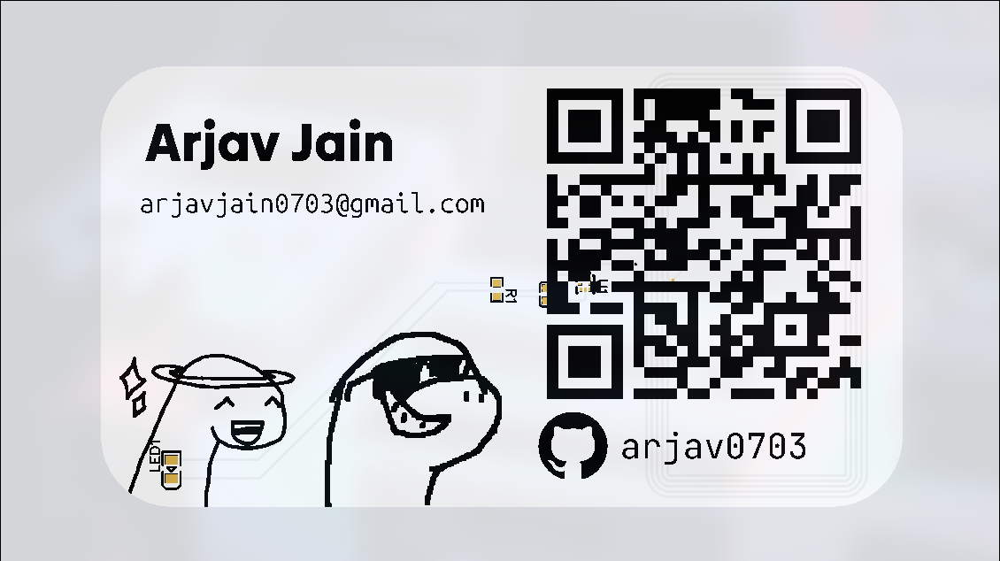
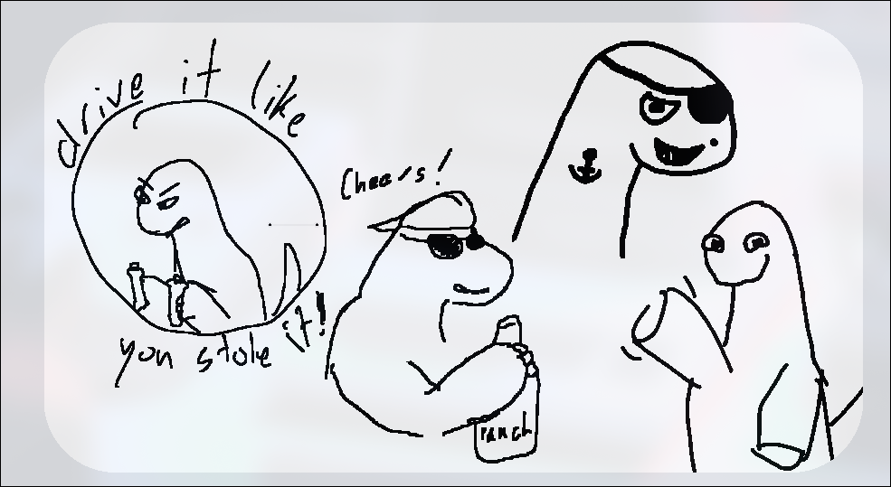

# Orpheus Card
### I made an NFC card that is themed with orpheus's doodles from the hackclub/dinosaurs repo by following Maggie's tutorial on it.

#### Followed the instructon video provided by maggie (thanks for it)
#### Also thanks to all of the people who gave me design inspiration from the hackclub/dinosaurs repo

## Design

The pcb board has two layers, the top layer is supposed to be assembled and have the electrical components with a design.
